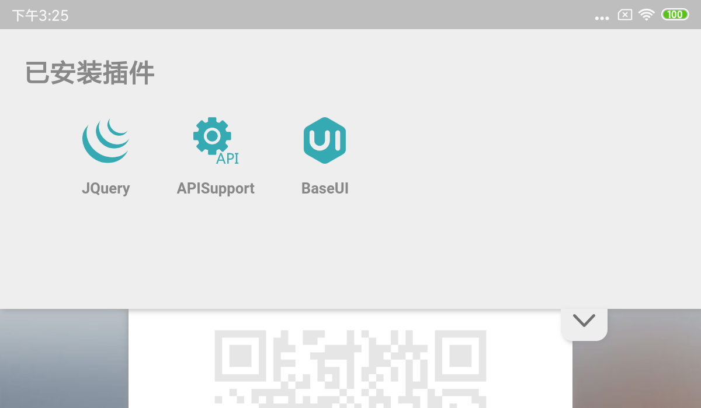

## 文件结构
除了一个config.json是必须存在的其余都无所谓。

一个最简单的插件即只有config.json描述文件的插件，它什么都不做。

## config.json结构
```json
{
    "name": "插件名",
    "desc": "插件描述",
    "author": "作者名",
    "icon": "插件图标",
    "showup_in_plugin_list": "是否显示在插件列表中",
    "settings": [
        {
            "id": "设置的唯一id",
            "name": "设置名称",
            "desc": "描述",
            "type": "设置类型，支持int,float,bool,string",
            "default": "默认值"
        },
        {
            ...
        }
    ],
    "inject": [
        "xxx.css","xxx.js"
    ]
}
```
如上是插件的所有字段，`settings`中的字段是插件的设置项，可以由用户设置，`inject`中的是需要向页面注入的文件，只支持css和js并且必须明确的写出小写扩展名，在页面加载完成后，`inject`中的文件将会按顺序注入到页面中。如上所有字段必须存在于config.json中并严格按照格式编写。

`showup_in_plugin_list`这个字段是布尔型，如果你的插件是类似API提供者那种静默运行的就可以设置成false，用户不会在插件列表中看到它，比如自带插件`JQuerySupport`、`APISupport`就都设置成了false
## 插件设置
`settings`字段中的所有设置项可以由用户进行自定义设置，插件开发者可以在js代码中通过`__env__`这个全局变量获取用户设置。

```js
__env__.getBoolSetting(id)
__env__.getFloatSetting(id)
__env__.getStringSetting(id)
__env__.getIntSetting(id)
```

如上四个方法可以直接返回对应类型的设置值

### 关于类型
目前还不会检测你获取的类型和预先在`config.json`中定义的类型是否匹配，若不匹配将造成类型转换错误，可能出现闪退

### 设置ID
如果你开发过VSCode插件，那么你可能对这种使用一个全局唯一的id来定义一个设置项并且使用id获取它的方法格外熟悉。VSCode就是采用了这种方法。

如果你没有开发VSCode插件的经验，那你一定要注意，这个id是全局唯一的，全局惟一的！全局惟一的！如果重复会抛出`SettingIdAlreadyUsedException`。所以定义id的时候请使用完全限定名降低重复的风险。

```
site.lilpig.wx4padplugin.show_deleted_msg.is_open
```

如上是一个完全限定名作为id的示例，它由`根域名.开发者网站域名.开发者网站二级域名.插件名.设置选项名`组成

## 原生toast
```js
__env__.toast(msg)
__env__.longToast(msg)
```

如上两行代码分别触发Android原生的短Toast和长Toast

## 获取插件列表
插件开发者可以通过如下API获取当前安装的插件列表
```js
__env__.getPluginList()
__env__.getPluginsShowUpInList()
```

第一个是获取所有插件，第二个只获取显示在插件列表中的插件

## UI操作
提供丰富的API操作界面（目前只开放了顶部Drawer的API），可以通过这些API向UI中添加新内容或修改UI。

### Drawer
Drawer是软件提供的顶部抽屉，它长这样



它就像一个抽屉，里面放了很多东西，用户想用某些东西时可以打开这个抽屉。插件可以把东西放到抽屉中，使用如下API

```
__env__.addToDrawer(title,node)
```

title就是你放的东西的名字，node就是你要放的东西，是一个HTML节点。图中的已安装插件就是通过这个API放置的。

## 示例
下面代码使用获取插件列表API和DrawerAPI制作一个在Drawer中显示已安装插件的功能，这也是自带的已安装插件的代码

```js
(function(){
    var plugin_list = $("<ul id='wx4pad_plugin_list'></ul>");
    var plugins = __env__.getPluginsShowUpInList();
    for(i in plugins){
        var plugin = plugins[i];
        var plugin_item = $("<li class='wx4pad_plugin_item'></li>");
        var plugin_icon = $("",{
            class: "wx4pad_plugin_item_icon",
            src: plugin.icon
        });
        var plugin_name = $("<div>",{
            class: "wx4pad_plugin_item_name"
        });
        plugin_name.text(plugin.name);
        plugin_item.append(plugin_icon);
        plugin_item.append(plugin_name);
        (function(i){
            plugin_item.click(function(){
                // 我也不知道为啥i是string 可能是JSON就这样吧，parse一下就好了
                __env__.openPluginUI(parseInt(i));
            })
        })(i)
        plugin_list.append(plugin_item);
    }
    __env__.addToDrawer("已安装插件",plugin_list);
}())
```

## 使用base64资源
目前还没有找到一个引入本地资源的好办法，所以推荐使用base64表示静态资源

## JQuery支持
JQuery已经作为内建插件内置在WeChat4PAD中，并保证在所有插件注入之前注入，所以插件开发者无需自行注入

## 关于
目前只是粗略的定义了这些内容，然后一遍修改一遍完善文档
