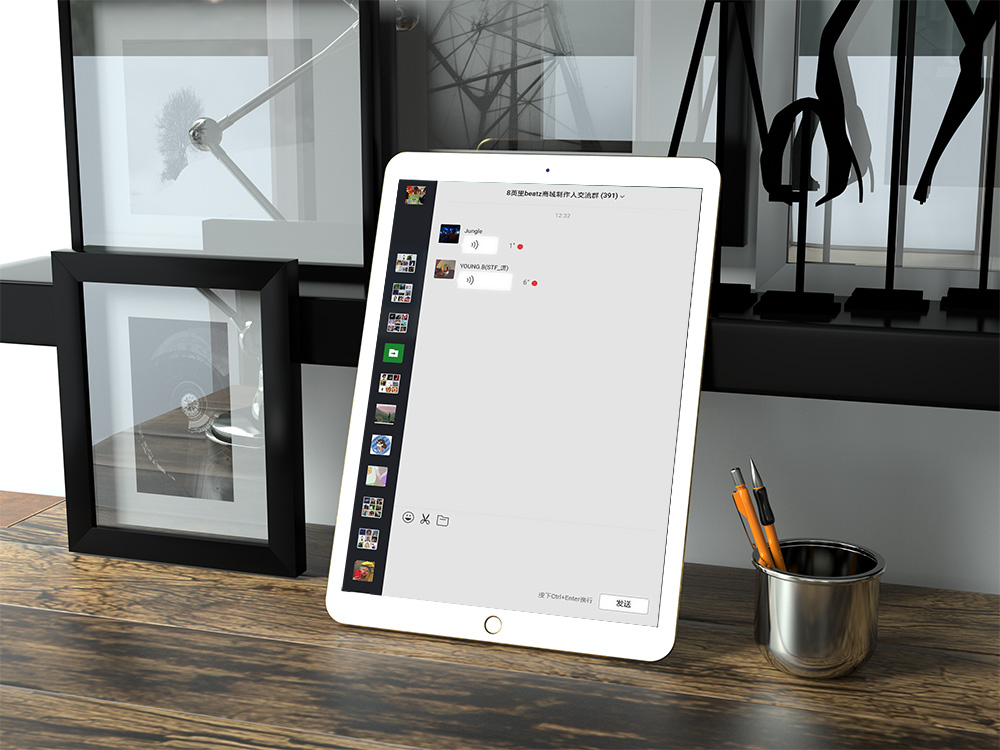

## WeChat For PAD
一切因穷而起...

WeChat For PAD是为解决Android平板上没有独立的微信而编写的

以往在Android平板上使用微信有两条路，一是使用手机版微信，这样会造成手机上的微信下线，手机和平板无法同时在线; 二是使用网页版，不过网页版默认是不支持手机浏览器的。即使通过修改UA标识，在浏览器上使用网页版，体验也不尽如人意。。。

WeChat For PAD使用Android原生WebView和微信网页版作为基础，通过注入JS和CSS代码对网页版进行优化和编写新功能，从而提供更适合Android平板的微信。

## 项目进度
- 2020/4/14  
    `[+]` 添加了顶部Drawer中的插件列表，开放顶部DrawerAPI，插件开发者可以向顶部Drawer添加自己的插件  
    `[+]` 爽了几天没写代码，增加顶部Drawer虽然现在Drawer里还啥都没有，优化输入法弹出时聊天界面的适配
- 2020/4/10  
    `[+]` 重构部分代码，编写WebView和JS插件之间的接口，具体在[插件规范](./PluginDoc.md)，面向插件提供读取用户设置的接口  
    `[-]` 今天我过生日耶，从初中以来就存在于每个生日的生日愿望达成了，开心
- 2020/4/09  
    `[+]` 定义[插件规范](./PluginDoc.md)，初步实现了插件化注入，并把昨天的代码用插件化形式重写

- 2020/4/08  
    `[+]` 对登陆页和聊天页的编辑区做平板优化  
    `[+]` 创建项目，实现了CSS和JS的注入功能，并且提供了一个基本的，适合平板的UI，今天可能懒得再写了...

## 期望的功能
- **!!!1st. 最期望的是我不要弃坑**
- 发送消息通知
- 多种自带主题、夜间模式
- 防撤回
- 比网页版更多的表情，和手机版同步
- 优化平板操作手感

## 灵感来源
[electronic-wechat](https://github.com/geeeeeeeeek/electronic-wechat/)
